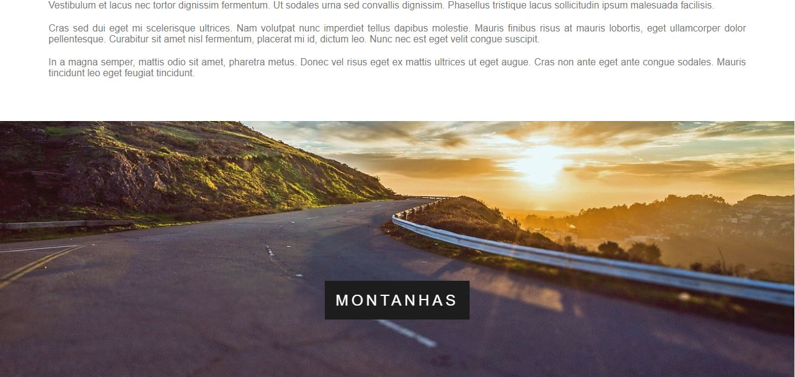

# Efeito Parallax
 Página simples, apenas para implementar o efeito parallax (CSS e HTML) 

 
 Alguns prints para ilustrar o site

Porém para visualizar melhor o efeito, é recomendado abri-lo diretamente no link
https://gustas01.github.io/Parallax/
